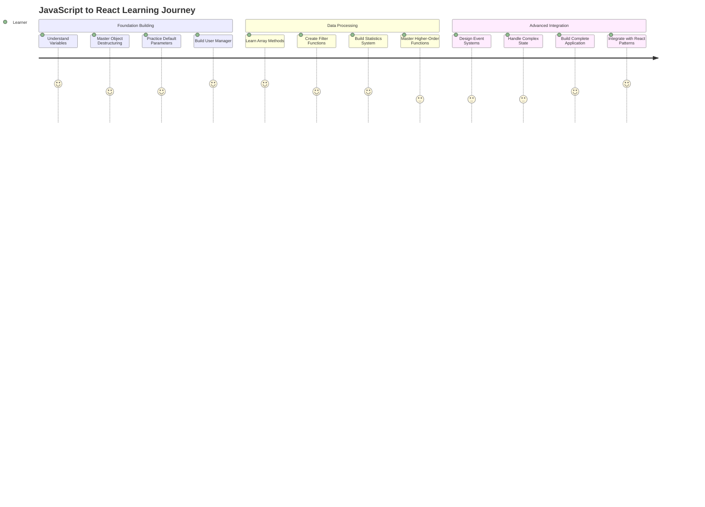

# JavaScript Fundamentals for React - Complete User Stories

## 📋 Overview

This document provides comprehensive user stories for all three JavaScript learning challenges. Each challenge builds upon the previous one, demonstrating progressive mastery of modern JavaScript concepts essential for React development.

---

## 🎯 Challenge Progression Summary

### Challenge 1: User Data Manager (Beginner)
**Focus**: Variables, Objects, Destructuring, Basic Functions  
**React Connection**: Props handling and state management  
**Story Count**: 9 core stories + React integration  

### Challenge 2: Task List Processor (Intermediate)  
**Focus**: Array Methods, Higher-Order Functions, Callbacks  
**React Connection**: List rendering and data transformation  
**Story Count**: 14 comprehensive stories + React patterns  

### Challenge 3: Shopping Cart System (Advanced)  
**Focus**: Event Systems, Complex State, All Concepts Combined  
**React Connection**: Event handling and component communication  
**Story Count**: 20 detailed stories + E-commerce domain  

---

## 🏆 Learning Journey Map

---

## 📊 Concept Coverage Matrix

| JavaScript Concept | Challenge 1 | Challenge 2 | Challenge 3 | React Application |
|-------------------|-------------|-------------|-------------|-------------------|
| **Variables (const/let)** | ✅ Core | ✅ Advanced | ✅ Expert | Component State |
| **Object Destructuring** | ✅ Core | ✅ Advanced | ✅ Expert | Props Handling |
| **Default Parameters** | ✅ Core | ✅ Advanced | ✅ Expert | Component APIs |
| **Array.map()** | ✅ Basic | ✅ Core | ✅ Advanced | List Rendering |
| **Array.filter()** | ✅ Basic | ✅ Core | ✅ Advanced | Conditional Display |
| **Array.reduce()** | ✅ Basic | ✅ Core | ✅ Advanced | Data Aggregation |
| **Arrow Functions** | ✅ Basic | ✅ Core | ✅ Advanced | Event Handlers |
| **Callbacks** | ✅ Basic | ✅ Core | ✅ Expert | Event System |
| **Higher-Order Functions** | ⭕ Intro | ✅ Core | ✅ Expert | Component Composition |
| **Event Systems** | ⭕ None | ⭕ Intro | ✅ Expert | React Events |

**Legend**: ⭕ Not Covered | ✅ Basic | ✅ Core | ✅ Advanced | ✅ Expert

---

## 🎓 User Story Categories

### 1. Functional Requirements Stories
Stories that define what the system should do from a user perspective.

**Challenge 1 Examples:**
- Create user profiles with validation
- Update user information with partial updates
- Filter users by preferences

**Challenge 2 Examples:**
- Filter tasks by multiple criteria
- Calculate comprehensive statistics
- Generate task summaries for display

**Challenge 3 Examples:**
- Add products to cart with validation
- Apply complex discount rules
- Process complete checkout flow

### 2. Technical Implementation Stories
Stories that focus on JavaScript concept mastery and implementation details.

**Common Patterns:**
- Use modern variable declarations appropriately
- Implement immutable data updates
- Create reusable higher-order functions
- Handle edge cases gracefully

### 3. React Integration Stories
Stories that demonstrate how JavaScript concepts translate to React development.

**Key Focus Areas:**
- Component prop destructuring patterns
- Event callback implementation
- State management compatibility
- Performance optimization strategies

### 4. Learning Verification Stories
Stories that validate understanding and skill acquisition.

**Assessment Criteria:**
- Code quality and best practices
- Concept application accuracy
- React readiness demonstration
- Problem-solving approach

---

## 🎯 Key Learning Outcomes by Challenge

### Challenge 1: Foundation Mastery
**Primary Outcomes:**
- ✅ Proper variable scoping with const/let
- ✅ Object destructuring with default values
- ✅ Immutable data update patterns
- ✅ Basic array method usage
- ✅ React props handling readiness

**Success Metrics:**
- All user CRUD operations working correctly
- Clean destructuring patterns throughout code
- Proper error handling for edge cases
- React component integration examples functional

### Challenge 2: Data Processing Expertise
**Primary Outcomes:**
- ✅ Mastery of all major array methods
- ✅ Higher-order function creation and usage
- ✅ Complex data transformation pipelines
- ✅ Statistical calculation patterns
- ✅ React list rendering optimization

**Success Metrics:**
- Efficient array method chaining
- Custom filter and sort function creation
- Performance-optimized data processing
- React component patterns ready for production

### Challenge 3: Advanced Architecture Skills
**Primary Outcomes:**
- ✅ Event-driven architecture implementation
- ✅ Complex state management patterns
- ✅ All JavaScript concepts integrated seamlessly
- ✅ Production-ready code structure
- ✅ Complete React application readiness

**Success Metrics:**
- Robust event system with proper cleanup
- Sophisticated discount and calculation logic
- Error-resilient user interface patterns
- Professional-grade code organization

---

## 📈 Skill Progression Indicators

### Beginner Level (Challenge 1)
- [ ] Can create and manipulate objects correctly
- [ ] Uses destructuring for clean parameter handling
- [ ] Implements basic array operations
- [ ] Understands React props patterns

### Intermediate Level (Challenge 2)
- [ ] Chains array methods effectively
- [ ] Creates reusable higher-order functions
- [ ] Handles complex data transformations
- [ ] Optimizes for React performance patterns

### Advanced Level (Challenge 3)
- [ ] Architects event-driven systems
- [ ] Manages complex application state
- [ ] Integrates all concepts seamlessly
- [ ] Builds production-ready components

---

## 🔗 React Integration Readiness

### Component Design Patterns
**Mastered Through Challenges:**
- Props destructuring with nested objects
- Default parameter usage in components
- Event callback implementation
- State structure optimization

### Data Flow Patterns
**Demonstrated Skills:**
- Array method usage for rendering
- State transformation with immutable updates
- Event propagation and handling
- Performance optimization strategies

### Advanced React Concepts
**Preparation Provided:**
- Higher-order component patterns
- Custom hook implementation readiness
- State management library integration
- Component composition strategies

---

## 📋 Story Implementation Checklist

### For Instructors
- [ ] Review all user stories for completeness
- [ ] Verify technical requirements align with learning objectives
- [ ] Ensure React integration examples are current
- [ ] Confirm success metrics are measurable

### For Students
- [ ] Read all user stories before starting challenges
- [ ] Implement stories in suggested order
- [ ] Test all acceptance criteria thoroughly
- [ ] Complete React integration exercises

### For Code Reviewers
- [ ] Validate all acceptance criteria are met
- [ ] Verify technical requirements implementation
- [ ] Check React pattern compatibility
- [ ] Assess code quality and best practices

---

## 🚀 Next Steps After Completion

### Immediate Applications
1. **Build a React Todo App** using Challenge 2 patterns
2. **Create an E-commerce Demo** using Challenge 3 architecture
3. **Develop a User Dashboard** using Challenge 1 foundations

### Advanced Learning Paths
1. **TypeScript Integration** - Add type safety to existing solutions
2. **State Management Libraries** - Integrate Redux or Zustand
3. **Backend Integration** - Connect to APIs and databases
4. **Testing Implementation** - Add unit and integration tests

### Career Development
1. **Portfolio Projects** - Showcase completed challenges
2. **Open Source Contributions** - Apply skills to real projects  
3. **Technical Interviews** - Use examples in coding interviews
4. **Mentoring Others** - Teach concepts to reinforce learning

---

## 📞 Support and Resources

### Getting Help
- Review challenge instructions and examples
- Check wireframe diagrams for architecture understanding
- Use provided starter files as guidance
- Compare with solution examples after attempting

### Additional Practice
- Modify challenges with your own requirements
- Combine concepts across different challenges
- Build variations with different data structures
- Create your own user stories for practice

### Community Engagement
- Share solutions and get feedback
- Collaborate on extended challenge versions
- Contribute improvements to challenge materials
- Help others learn through explanation and teaching

---

**Remember**: The goal isn't just to complete the challenges, but to deeply understand how JavaScript concepts translate to React development patterns. Each user story builds toward real-world application development skills!